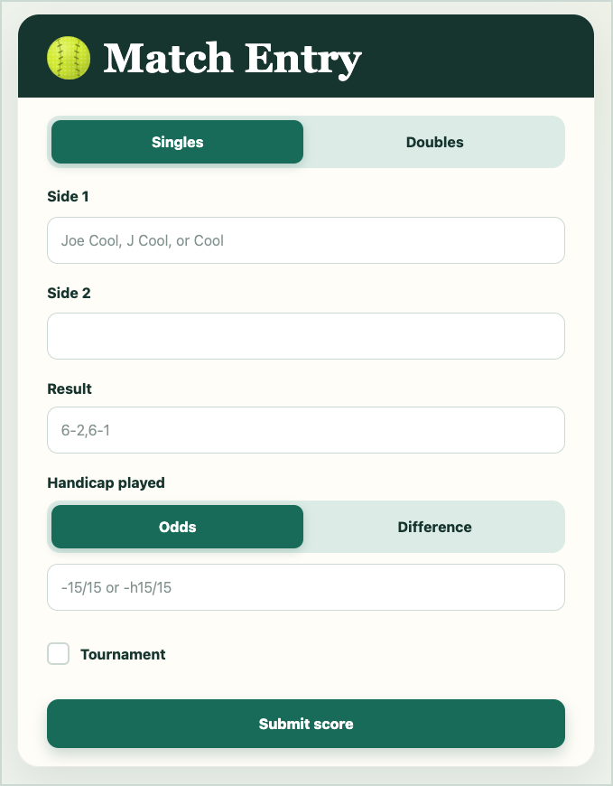
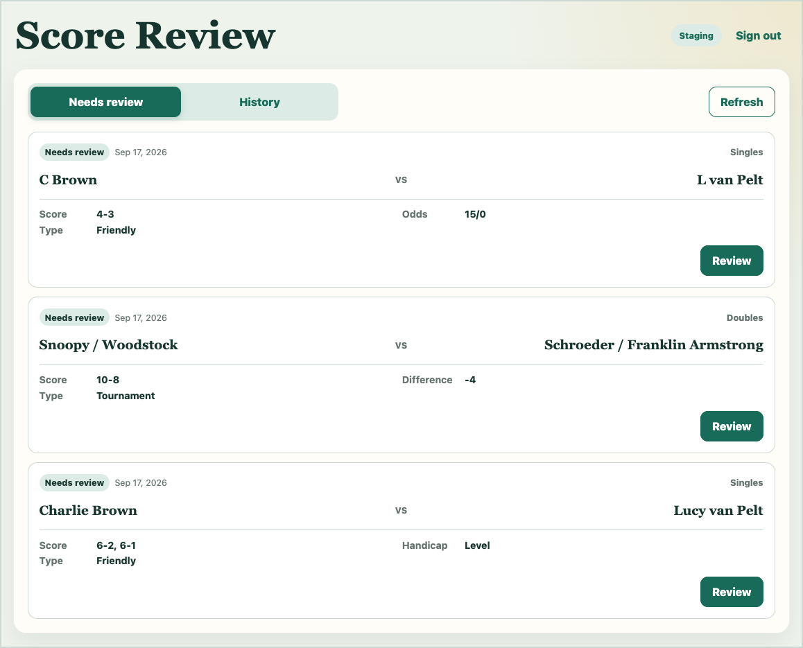
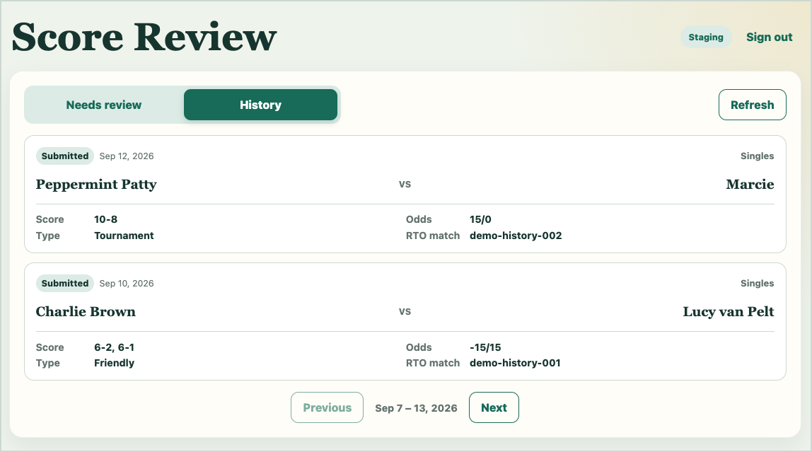

# sweet-spot

Sweet Spot is a mobile match-entry queue for court tennis scores. Every component lives in this repository and is built,
tested, and published through the root scripts.

## Screenshots

| Match entry                                                  | Administrator sign-in                                              |
| ------------------------------------------------------------ | ------------------------------------------------------------------ |
|  |  |

| Needs review                                                       | History                                                                |
| ------------------------------------------------------------------ | ---------------------------------------------------------------------- |
|  |  |

## Components

- `apps/intake`: public mobile Apps Script application for player submissions
- `apps/pages`: generated full-viewport GitHub Pages routes
- `apps/admin`: private score-review application
- `packages/shared`: request, response, and queue types shared by every component
- `tools`: TypeScript build and publishing commands

The admin application requires an RTO account with the Boston `ADM-MATCH` role. It validates the RTO session before reading
the queue, keeps the token in browser `sessionStorage`, and searches the RTO player directory when a score is reviewed.
Production submits approved matches to RTO; staging writes fake RTO match IDs.

## Commands

```shell
npm install
npm run check
npm run format
npm run seed:local
npm run inspect:local
npm run dev:intake
npm run dev:admin
npm run build:pages
```

The local intake application is served at <http://127.0.0.1:4173>, and the local admin application is served at
<http://127.0.0.1:4174>. Any non-empty credentials enter the local-only admin demo. Submissions are written to ignored JSON
files under `local-data/`, with one file representing each weekly Sheet tab. The admin demo directory is cached in browser
`sessionStorage` and cleared when the tab closes.

The intake form enforces required match data in the browser and on the server. After submission, the receipt screen can
withdraw the queue row and restore the form for correction. Withdrawn rows remain in the queue for audit purposes and are
excluded from the admin inbox.

## Google deployments

Staging and production use separate Apps Script projects, deployments, and queue spreadsheets:

```shell
npx clasp login
npm run deploy:intake:staging
npm run deploy:intake:production
npm run deploy:admin:staging
npm run deploy:admin:production
```

Each deploy command reconciles its environment: it creates a missing Apps Script project, runs all checks, pushes generated
artifacts, creates or updates the stable deployment, provisions the queue spreadsheet on first load, and verifies the live
page. The checked-in `.clasp.<environment>.json` and `.deployment.<environment>-id` files bind each environment to its Google
resources.

Google's deployment API does not apply a web app's access setting. The first deploy for each environment therefore requires
one manual step in the Apps Script editor: open **Deploy > Manage deployments**, edit the generated deployment, set **Who has
access** to **Anyone**, deploy, and accept the authorization prompt. Later deploys update the same deployment ID and need no
manual work. If verification finds the deployment owner-only, the command prints the editor URL and these instructions.

The intake setup function creates the private queue spreadsheet and logs its URL. Scores are grouped into ISO-week tabs such as
`2026-W38`. The review application will scan every weekly tab and present one inbox containing every row that is neither
`Submitted` nor `Withdrawn`.

Each admin deployment reads its queue spreadsheet ID and RTO submission mode from its environment JSON file. Apps Script
project IDs and stable deployment IDs are checked in beside each component. Generated build artifacts remain ignored.

## GitHub Pages

The Pages workflow runs `npm run build:pages` and publishes `apps/pages/dist`. The build reads the stable Apps Script
deployment IDs and generates these routes:

- `/sweet-spot/staging/`, which hosts match entry
- `/sweet-spot/staging/admin/`
- `/sweet-spot/`, which hosts production match entry
- `/sweet-spot/admin/`, which hosts production score review

Pushing a relevant configuration or deployment ID change to `main` redeploys Pages. A missing deployment ID fails the Pages
build instead of publishing a partial route tree.

The intake manifest declares that each web app runs as the project owner with anonymous access. Deployment IDs are stored
independently under `apps/intake/`.

The manifest pins the intake application's OAuth access to Google Sheets. The current `SpreadsheetApp` implementation can
read and write every spreadsheet available to the deploying account, although the application stores and opens only its own
queue spreadsheet ID. It has no Gmail, Calendar, Contacts, general Drive-file, or RTO access. Restricting access to only the
queue file requires replacing `SpreadsheetApp` with the Sheets API and its `drive.file` scope.

## RTO administrator sessions

The private review application authenticates through its Apps Script server. The server sends the credentials to RTO over
HTTPS, validates the returned token, and requires the Boston match-administrator role. It discards the password after login
and returns the RTO JWT to browser `sessionStorage`. Each protected server operation revalidates the token with RTO. Closing
the tab or choosing sign out clears the token. Credentials and tokens are never written to Sheets, Apps Script properties,
logs, or `localStorage`.
