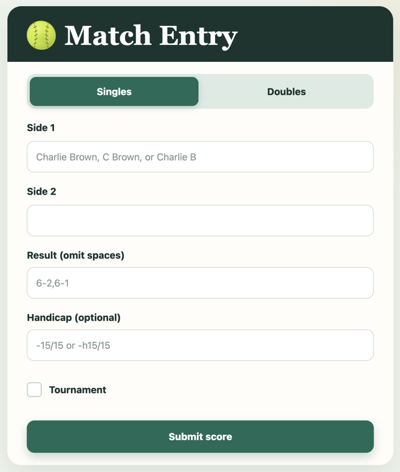
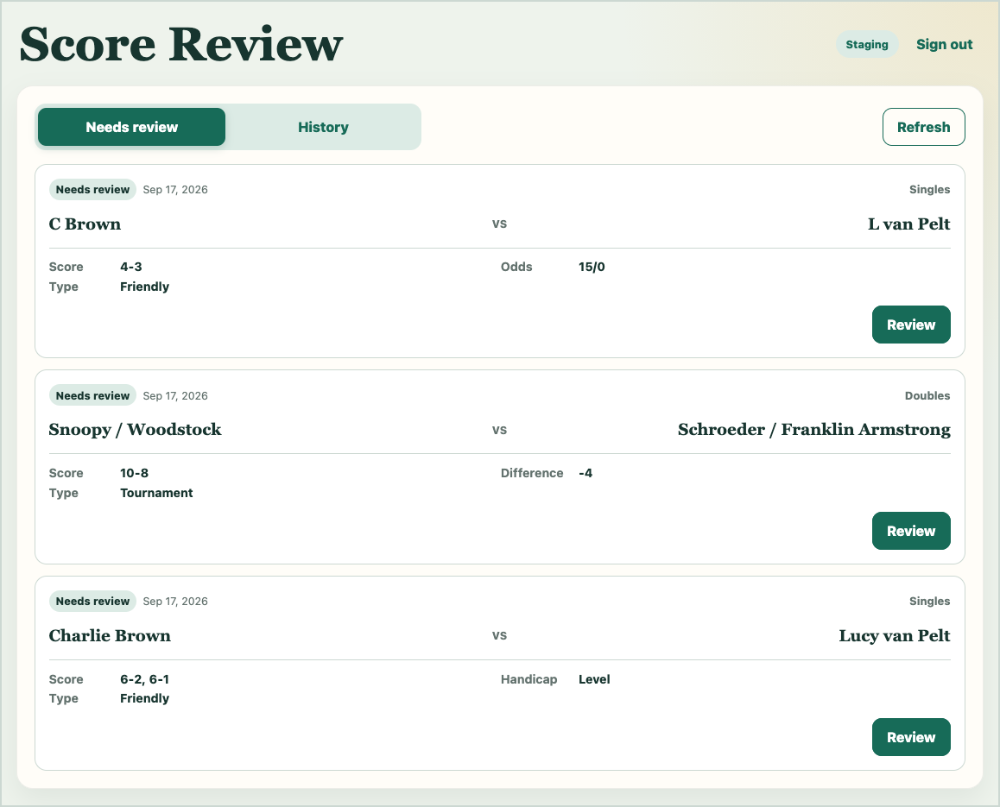
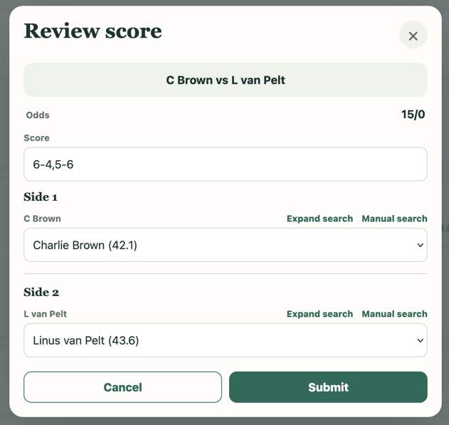
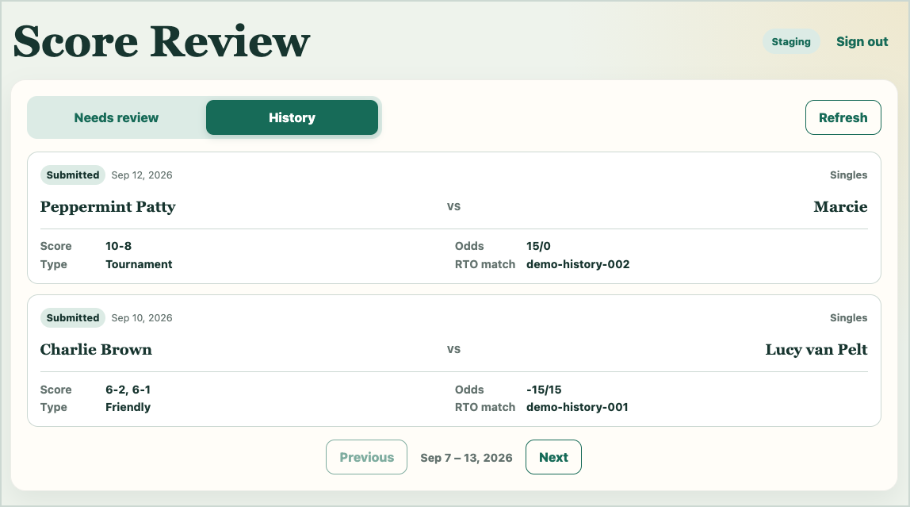

# sweet-spot

Sweet Spot is a mobile match-entry queue for court tennis scores. Players submit scores from their phones, and a Boston
match administrator reviews each one and submits it to RTO.

## Screenshots

| Match entry                                                  | Administrator sign-in                                              |
| ------------------------------------------------------------ | ------------------------------------------------------------------ |
|  |  |

| Needs review                                                       | Review score                                                     |
| ------------------------------------------------------------------ | ---------------------------------------------------------------- |
|  |  |

| History                                                                |
| ---------------------------------------------------------------------- |
|  |

## Components

- `apps/intake`: public match-entry form, served from GitHub Pages and backed by Apps Script
- `apps/admin`: private Score Review application on Apps Script
- `apps/pages`: generated GitHub Pages routes
- `packages/shared`: request, response, and queue types
- `tools`: build, local development, and publishing commands

Both clients use Preact. Each screen keeps its state in a view model (`*-model.ts`) that is unit tested without a browser.

## Local development

```shell
npm install
npm run check         # format, lint, typecheck, test, build
npm run seed:local    # write dummy queue data to local-data/
npm run inspect:local # print the local queue
npm run dev:intake    # http://127.0.0.1:4173
npm run dev:admin     # http://127.0.0.1:4174
```

The local servers use JSON files in `local-data/` in place of the queue spreadsheet, one file per weekly tab. The local admin
accepts any credentials and uses a fake RTO directory, and submitting writes a fake RTO match ID.

## Queue

Submissions go to ISO-week tabs such as `2026-W38` in a queue spreadsheet, one spreadsheet per environment. A player can undo
a submission right after sending it, which marks the row `Withdrawn`.

Score Review's **Enter score** tab adds scores to the queue with a match date and a sanctioned tournament flag, and clears the
players after each one so an administrator can enter several in a row. Rows land in the week tab of the day they are entered,
whatever their match date. Score Review can also delete a score that has not reached RTO, and lets the reviewer override the
score and odds. A sanctioned score requires choosing its RTO sanctioned match before submitting.

Score Review shows every score that is neither `Submitted` nor `Withdrawn` under **Needs review**, whatever its week, and
the rest under **History**, one week per page. It keeps an index of which tabs hold each kind of score in its script
properties, so a load reads only the tabs it needs. The index is rebuilt from every tab once a day.

## Deployment

```shell
npx clasp login
npm run deploy:intake:staging
npm run deploy:admin:staging
npm run deploy:intake:production
npm run deploy:admin:production
```

Each command runs `npm run check`, builds, pushes to its Apps Script project, updates its stable deployment, and checks that
the live page responds. The checked-in `.clasp.<environment>.json` and `.deployment.<environment>-id` files bind each
environment to its Google resources, and each admin environment reads its spreadsheet ID and RTO submission mode from its
JSON file. Staging writes fake RTO match IDs instead of submitting to RTO.

A new environment needs one manual step, because Google's API does not set web app access. In the Apps Script editor, open
**Deploy > Manage deployments**, edit the deployment, set **Who has access** to **Anyone**, and accept the authorization
prompt. The deploy command prints these instructions if it finds an owner-only deployment.

Pushing to `main` rebuilds GitHub Pages when intake, shared code, build tools, or a deployment ID changes. The routes are:

| Route                        | Serves                           |
| ---------------------------- | -------------------------------- |
| `/sweet-spot/`               | Production match entry           |
| `/sweet-spot/admin/`         | Production Score Review (framed) |
| `/sweet-spot/staging/`       | Staging match entry              |
| `/sweet-spot/staging/admin/` | Staging Score Review (framed)    |

The match-entry page opens a hidden Apps Script bridge as it loads, and the bridge handles submission and undo.

## Security

- Score Review requires an RTO account with the Boston `ADM-MATCH` role. The Apps Script server sends credentials to RTO,
  discards the password, and returns the RTO token to browser `sessionStorage`. Signing out or closing the tab clears it.
- Every server request checks the token's expiry and role. A successful RTO validation is cached for five minutes, keyed by
  a hash of the token. Tokens and passwords are never written to Sheets, script properties, logs, or `localStorage`.
- The intake app runs as the project owner with anonymous access. Its OAuth scope covers Google Sheets only, and it opens
  only its own queue spreadsheet. `SpreadsheetApp` could still reach any spreadsheet the owner can; limiting it to one file
  would require the Sheets API with the `drive.file` scope.
